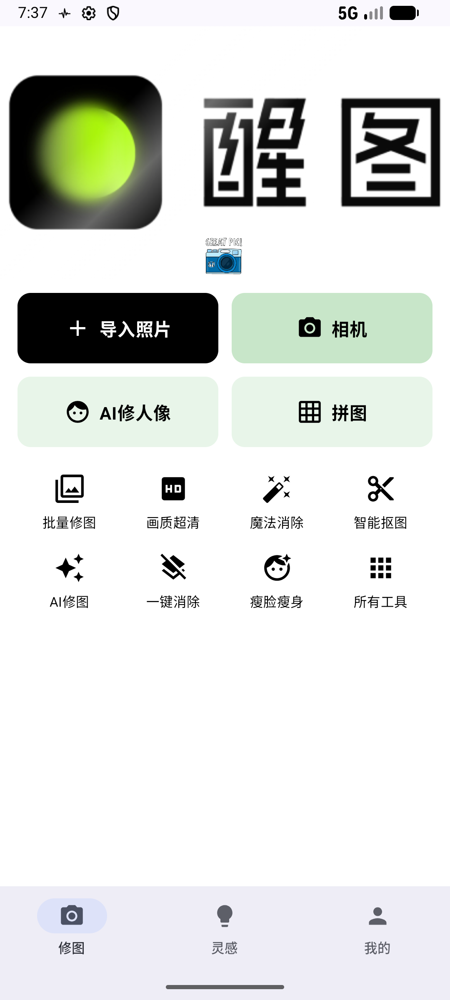
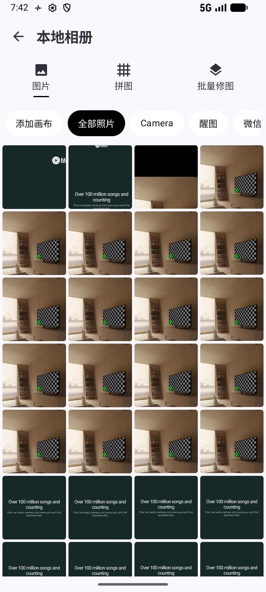
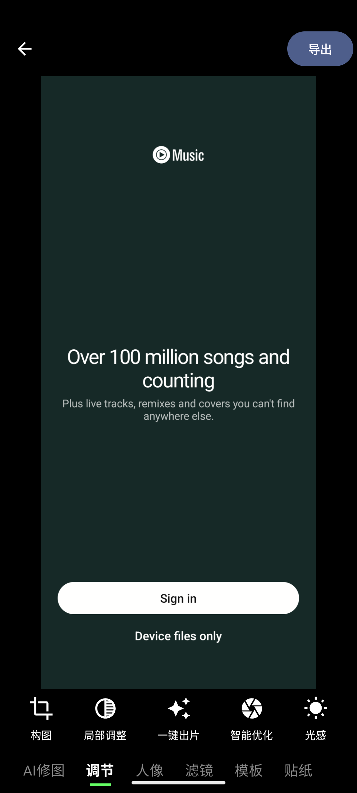
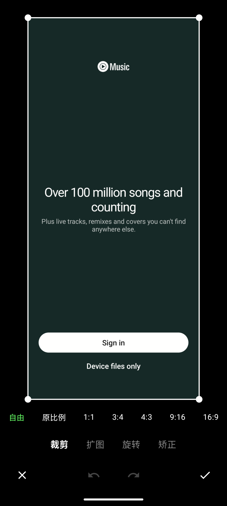

# 📸 Android High-Performance Photo Editor

这是一个基于 **Kotlin** 和 **Jetpack Compose** 构建的现代化 Android 图片编辑应用。

不同于传统的 View 体系应用，本项目采用了 **混合渲染架构**：使用 **Jetpack Compose** 构建声明式 UI，核心图片渲染层采用 **OpenGL ES 2.0**，实现了在处理高分辨率图片时的 60FPS 流畅预览、无损缩放与高性能裁剪。

## ✨ 核心功能 (Features)

* **🚀 高性能渲染引擎**：利用 `GLSurfaceView` 和自定义 Shader，将图片作为纹理处理，实现 0 内存增长的实时缩放、平移预览。
* **✂️ 智能裁剪系统**：
    * 手写交互逻辑，支持 8 点触控拖拽（四角 + 四边）。
    * 包含边界约束算法，防止裁剪框移出边界。
    * 支持固定比例锁定（1:1, 16:9 等）与自由比例切换。
    * 支持 **撤销/重做 (Undo/Redo)** 操作历史栈。
* **🖼️ 沉浸式相册管理**：基于 `ContentResolver` 和协程异步加载系统相册，使用 `Coil` 进行缩略图内存优化。
* **💾 高质量导出**：编辑过程采用无损预览，仅在导出时使用 `BitmapUtils` 进行物理像素切割，自动纠正 EXIF 旋转信息。
* **🎨 现代化 UI**：全线采用 Material 3 设计风格，包含流光特效 Banner 和丝滑的转场动画。

## 📱 应用截图 (Screenshots)

| 首页 (Home) | 系统相册 (Album) | OpenGL 编辑器 (Editor) | 智能裁剪 (Crop) |
|:---:|:---:|:---:|:---:|
|  |  |  |  |
| *流光特效与功能入口* | *基于 LazyGrid 的高性能列表* | *双指缩放与实时预览* | *支持撤销/重做与比例锁定* |

## 🛠 技术栈 (Tech Stack)

* **语言**: Kotlin
* **UI 框架**: Jetpack Compose (Material3)
* **架构模式**: MVVM + Single Activity (单向数据流)
* **图形渲染**: OpenGL ES 2.0 (GLSL Shaders), `GLSurfaceView`, `AndroidView` Interop
* **图片加载**: Coil (Coroutines Image Loader)
* **异步处理**: Kotlin Coroutines (Dispatchers.IO / Main)
* **系统组件**: MediaStore, ContentProvider, ActivityResultContracts (权限管理)

## 📂 项目结构 (Project Structure)

```text
com.example.photoeditor
├── MainActivity.kt          // [UI] 路由中心，管理全屏状态分发
├── MainViewModel.kt         // [ViewModel] 数据持有层，负责异步扫描相册
├── ui.theme                 // [Theme] Compose 主题配置
├── screen
│   ├── AlbumScreen.kt       // [UI] 相册选择页，处理权限与列表展示
│   ├── EditorScreen.kt      // [UI] 编辑器容器，处理手势与 OpenGL 视图桥接
│   └── CropScreen.kt        // [UI] 裁剪交互页，包含 Canvas 自绘与手势算法
├── renderer
│   └── ImageRenderer.kt     // [Core] OpenGL 渲染引擎，负责纹理映射与 Shader 绘制
└── utils
    └── BitmapUtils.kt       // [Utils] 底层图像处理，负责 IO 读写与物理裁剪
```

## ⚡️ 快速开始 (Getting Started)

### 环境要求 (Prerequisites)

* **Android Studio**: Hedgehog | 2023.1.1 或更高版本
* **Kotlin Plugin**: 1.9.0+
* **JDK**: 17
* **minSdk**: 24 (Android 7.0)
* **targetSdk**: 34 (Android 14)

### 构建与运行 (Build & Run)

1.  **克隆项目**

    ```bash
    git clone https://github.com/Lnhoww/PhotoEditor.git
    ```

2.  **打开项目**
    启动 Android Studio，选择 `File > Open`，定位到项目根目录。

3.  **同步 Gradle**
    等待 Android Studio 自动下载依赖并同步 Gradle 配置。确保网络连接正常（可能需要配置代理以访问 Google Maven 仓库）。

4.  **运行应用**

    * 连接真机（推荐，以获得最佳 OpenGL 性能）或启动 Android 模拟器。
    * 点击工具栏上的 ▶️ **Run 'app'** 按钮。

### 权限说明

* **Android 13+ (API 33+)**: 应用会请求 `READ_MEDIA_IMAGES` 权限。
* **Android 12及以下**: 应用会请求 `READ_EXTERNAL_STORAGE` 权限。
* *注意：首次进入相册页时请允许权限授权，否则无法加载图片。*

## 🤝 贡献 (Contributing)

欢迎提交 Issue 或 Pull Request！

1.  Fork 本仓库
2.  新建 Feat\_xxx 分支
3.  提交代码
4.  新建 Pull Request

